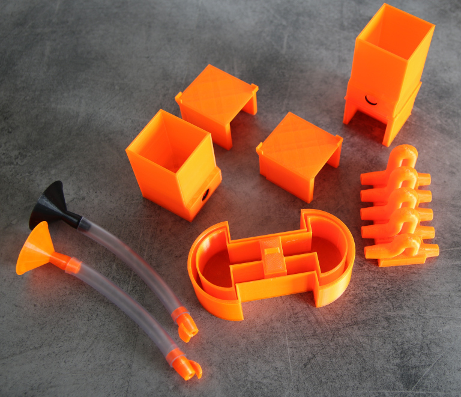
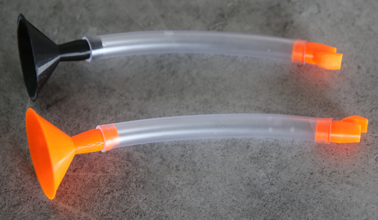
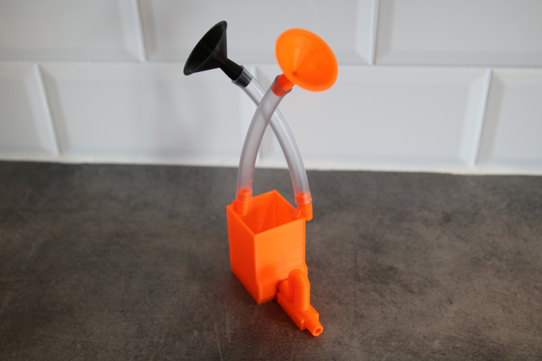
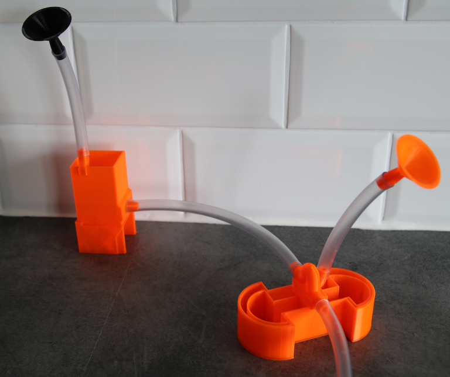

# 3d printable neural network puzzle

A water based 3d printable neural network puzzle.

## A lego like experience

The idea behind this project is to create a few Lego like components from which a simple neural networks can be created. A tactile and visual way of building a neural network may provide a deeper understanding of what machine learning is and how a machine learned model may look like.

The components in it's current form can be used to demonstrate how neurons perform a simple classification task. More iteration of the components would however be needed in order to achieve a Lego like experience.

## Additional components

5 mm gaskets and 8 mm pvc hose is needed in addition to the 3d printed parts.

## The neural components

By using the components, it's now possible to demonstrate a two layer neural network that perfoms a simple classification task.

### Dendrite and receptor

The dendrite is represented by a plastic pipe which is used to lead water to the soma (cell body).

### Soma and the hillock

The soma is a simple container which works as  summation function of all incoming that are inserted through the dendrites.

The hillock is actually a bell siphon that is activated once "the sum" of all wather reaches a specific level. Once activated, the bell hillock will transfer all the wather in the soma to the axon.

### Negative weights on dendrites

Allowing a negative weight on a dendrite is so far a tricky task. The current solution let's the watherfrom a negative weigthed dendrite makes the hillock float up which results in an increase level  where the hillock is activated.

# What's next?

More specific instructions, for a video could be created if some one out there find this project fascinating.

# Licens
CC BY-SA 4.0

https://creativecommons.org/licenses/by-sa/4.0/
